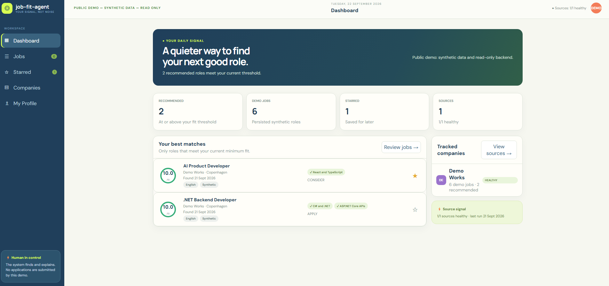
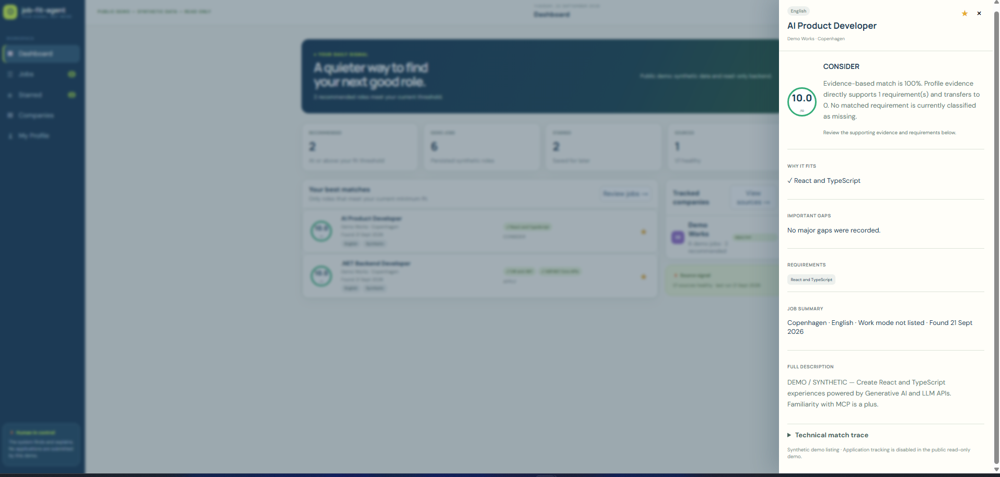
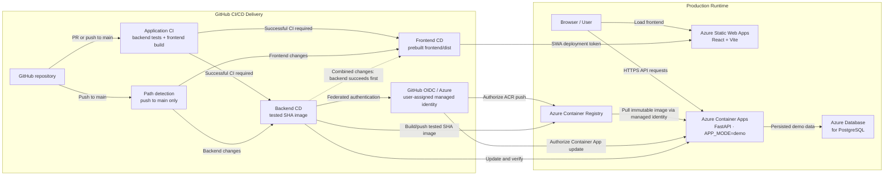

# Job Fit Agent

Job Fit Agent turns a job posting into a reviewable fit assessment: structured requirements, evidence-backed matches, explicit gaps, confidence, and a recommendation. It is designed to keep consequential decisions with a person.

**[Open the public demo](https://calm-wave-00271bf0f.4.azurestaticapps.net)**

> The public demo is read-only and uses synthetic candidate, job, and evidence data only. It never discovers live jobs, submits applications, or contacts external sources. The Azure Container Apps backend scales to zero, so the first load after inactivity can take roughly 10–30 seconds.

## What it demonstrates

- A source architecture for allowlisted careers pages: contracts, robots enforcement, rate limits, normalization, deduplication, source health, and human approval gates.
- Structured LLM job analysis in the mutable workflow architecture, followed by deterministic, evidence-backed matching.
- Persisted score, confidence, recommendation, requirement classifications, gaps, and trace data exposed through a React dashboard.
- Server-side job search and facets; the browser never recalculates match scores or filters independently.
- A bounded, opt-in agentic-search fallback that can only refine a zero-result persisted search. It is not an autonomous agent and is disabled by default.
- A local stdio MCP server with four read-only tools for persisted job search, detail, match analysis, and candidate evidence.
- Human-controlled application and grounded cover-letter domain workflows, which are intentionally disabled in the public demo.

## Product preview



*Synthetic dashboard: persisted, evidence-backed job-fit results for human review.*



*Job detail: explainable requirements, supporting evidence, confidence, and explicit gaps.*

## Architecture

```text
React + TypeScript UI -> FastAPI API -> PostgreSQL
                            |
                     job_fit_core matching
```

The demo seeds six synthetic jobs with validated persisted analyses and matches. The public UI reads those records through FastAPI; matching and evidence remain server-side.

The application architecture above stays separate from the production runtime and delivery path:



See [Architecture](docs/architecture.md) for the complete topology and [Deployment](docs/deployment.md) for operational details.

## Safety and human control

`APP_MODE=demo` is the public default and is enforced by the backend, not just the UI. It permits health, readiness, dashboard, search, details, evidence, source-health, and trace reads. It blocks live discovery, onboarding fetches, daily external runs, ordinary OpenAI calls, cover-letter generation, application/source mutations, and external communication.

The architecture includes source processing, application state, and cover-letter services for controlled non-demo operation. Their presence does not mean the public demo performs those actions. See [Security and demo boundary](docs/security.md).

## AI, MCP, and evaluation

Normal search and matching are deterministic over persisted data. The optional agentic-search fallback is narrowly bounded to query refinement and a persisted read tool; it cannot invent entities, mutate records, discover sources, or communicate externally. The MCP server is local stdio only and exposes no write tools. See [AI and MCP](docs/ai-and-mcp.md).

The repository includes a synthetic, versioned 12-case evaluation suite for agentic-search safety and retrieval contracts, exercised offline with fake providers by default. The suite does not claim live model-quality measurement. See [Evaluation](docs/evaluation.md).

## Local quick start

Prerequisites: Docker Desktop, Python 3.13, and Node.js 22.

```powershell
Copy-Item .env.example .env
python -m pip install -r requirements.txt -r requirements-dev.txt
Push-Location frontend
npm ci
Pop-Location

docker compose up -d postgres
docker compose run --rm backend python -m scripts.run_migrations
docker compose run --rm backend python -m scripts.seed_demo
docker compose up -d backend frontend
```

Open `http://localhost:5173`. The backend exposes `GET /health` and `GET /ready` on `http://localhost:8000`.

Run verification from the repository root:

```powershell
pytest -q
Push-Location frontend
npm run build
Pop-Location
```

## Delivery

Pull requests run backend tests and a frontend production build. A successful push to `main` can deploy only the affected component: backend changes build an immutable SHA-tagged image and update Azure Container Apps; frontend changes build and deploy `frontend/dist` to the existing Azure Static Web App. Manual deployment workflows remain available as an operational fallback. See [Deployment](docs/deployment.md).

## Documentation

- [Architecture](docs/architecture.md)
- [AI and MCP](docs/ai-and-mcp.md)
- [Evaluation](docs/evaluation.md)
- [Security and demo boundary](docs/security.md)
- [Deployment](docs/deployment.md)
- [Engineering highlights](progress-log.md)

## License

This project is licensed under the [MIT License](LICENSE).
