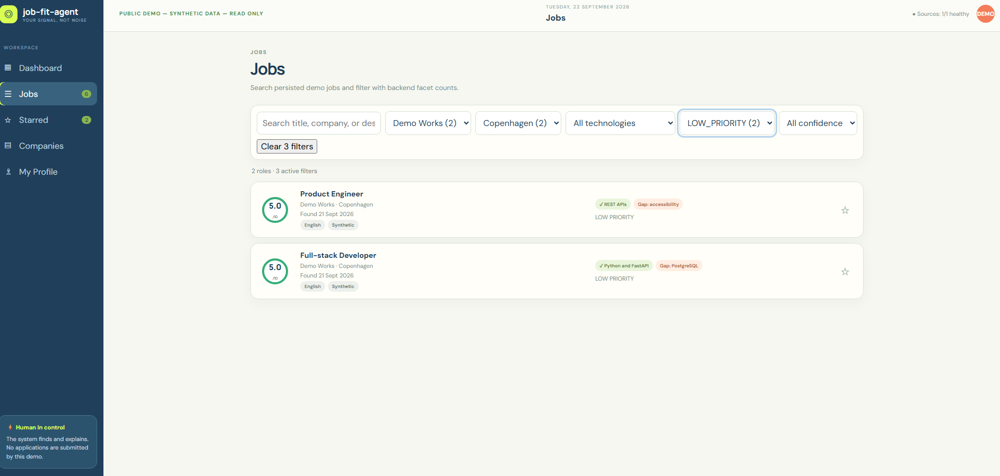
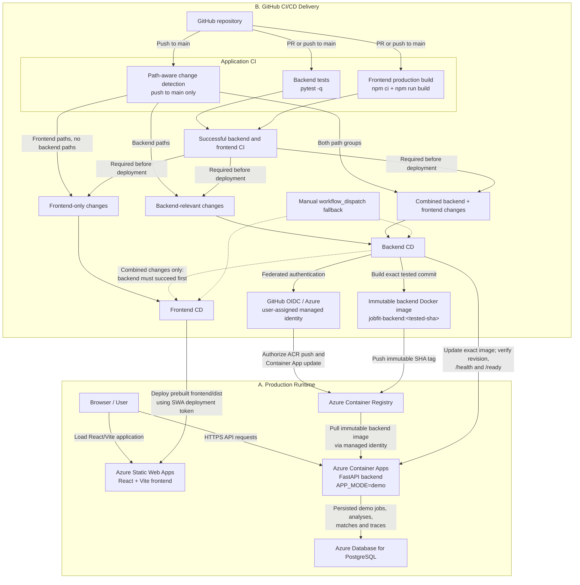

# Architecture

Job Fit Agent V3 is a public portfolio demo derived from a private baseline. Its runtime has no private candidate, CV, application-history, or source-acquisition data.

```text
React/TypeScript UI -> FastAPI API -> PostgreSQL
                         |          ^
                    job_fit_core    | Alembic + synthetic demo seed
```

The frontend reads persisted dashboard and search read models. `GET /api/search/jobs` performs server-side text search across stored title, company, location, description, requirements, and gaps; its company, location, technology, decision, and confidence facets also come from the server. React does not re-score or duplicate filters.



*Search and facet controls use persisted server read models; the browser does not recalculate scores or filters.*

The Python application keeps domain matching in `job_fit_core`, with persisted jobs, analyses, matches, evidence, sources, and run traces. `scripts.seed_demo` creates six clearly synthetic records and their validated persisted match outputs. It is idempotent.

The public UI is read-only. Local browser stars are a convenience-only UI preference, not an application state change. Existing application and source lifecycle models remain part of the reusable architecture, but demo mode blocks their write paths.

Database migrations are an explicit deployment step; the backend container does not own migration execution.

## Azure runtime and CI/CD delivery

The application diagram above describes responsibilities inside the product. The following diagram is intentionally separate: it describes the deployed Azure topology and how a tested commit reaches that runtime without mixing in domain, matching, source, or MCP internals.



Pull requests run validation only. For a push to `main`, path detection runs alongside backend and frontend validation inside the Application CI workflow; production jobs remain gated on both validation jobs succeeding. The workflows pass the exact tested commit SHA into component deployment. Component-specific concurrency prevents deployment races, and running deployments are not cancelled.
