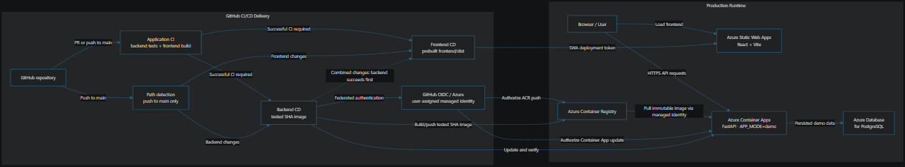

# Deployment and delivery

Job Fit Agent V3 is deployed as a public, read-only synthetic-data demo. The browser loads the React/Vite frontend from Azure Static Web Apps and calls the FastAPI API in Azure Container Apps directly; Static Web Apps does not proxy API traffic. See [Architecture](architecture.md#azure-runtime-and-cicd-delivery) for the complete runtime and delivery diagram.

The frontend is hosted by Azure Static Web Apps. The FastAPI backend runs in Azure Container Apps in North Europe and pulls from Azure Container Registry through its existing managed identity. PostgreSQL Flexible Server uses private VNet integration. Runtime configuration is held in Container Apps secrets; the backend CORS configuration allows the exact Static Web Apps origin.

## Delivery pipeline

GitHub Actions provides the delivery path:

1. **Application CI** runs backend `pytest -q` and the frontend production build for pull requests and pushes to `main`.
2. On a successful push to `main`, native Git-range path detection decides whether backend, frontend, or both components changed. Documentation, tests, evaluation, local Compose, and workflow-only changes do not deploy application components.
3. **Backend CD** receives the exact tested commit SHA, builds `acrjobfitamjadneu.azurecr.io/jobfit-backend:<sha>`, pushes it using GitHub OIDC authentication, and updates only the Container App image. The workflow verifies the exact revision image, waits for provisioning, then requires `/health` and `/ready` to return HTTP 200.
4. **Frontend CD** checks out the same tested SHA, builds `frontend/dist` with the configured public `VITE_API_URL`, and deploys the already-built assets to the existing Static Web App using its deployment token.

When both components change, backend deployment completes successfully before frontend deployment begins. Component-specific concurrency groups prevent overlapping production deployments; running deployments are not cancelled. Backend and frontend CD workflows also retain `workflow_dispatch` as an operational fallback.

*Rendered CI/CD and Azure delivery architecture overview. The [Mermaid architecture diagram](architecture.md#azure-runtime-and-cicd-delivery) remains the authoritative representation of the system.*

## Authentication and image identity

Backend delivery uses GitHub OIDC with `azure/login@v3`, the repository's Azure client/tenant/subscription identifiers, and no client secret or ACR admin credential. Backend images are identified and deployed by the immutable tested commit SHA, never `latest`.

Frontend Static Web Apps upload uses `AZURE_STATIC_WEB_APPS_API_TOKEN`, stored only as a GitHub secret. `VITE_API_URL` is a public repository variable because Vite embeds it in browser assets; it is not a secret.

## Database and demo data

Migrations are explicit deployment operations; the web process does not run Alembic on startup. The synthetic demo seed is idempotent and is run separately from web startup. The deployed public environment uses `APP_MODE=demo`, with agentic search disabled by default.

## Scale to zero

Azure Container Apps may scale the backend to zero after inactivity. Deployment verification and the public UI use bounded retries to accommodate cold starts. Visitors may see a short loading state, typically around 10–30 seconds after inactivity; warm requests are substantially faster.
